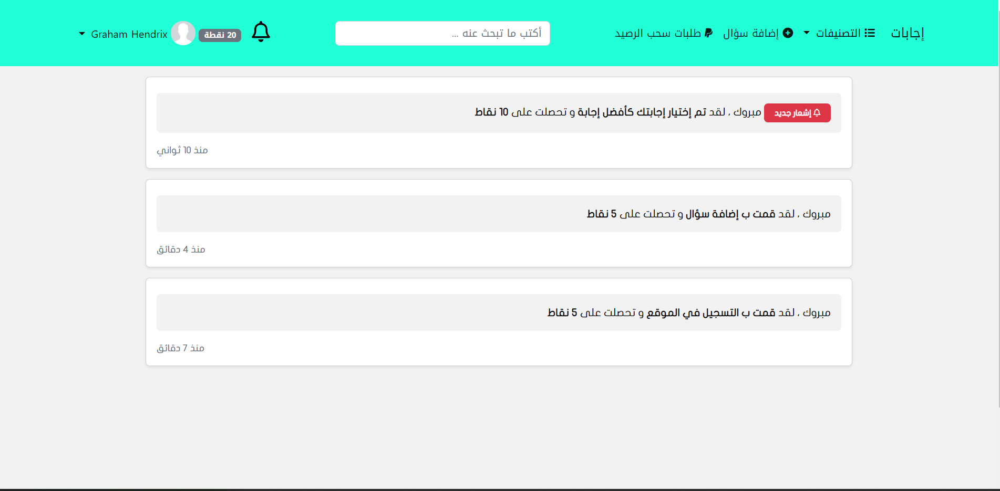

# About

Question and answer website where users can register, login, Once registered, users can post questions and receive answers from other users.

To encourage `user participation`, the platform `awards points to users` when they create questions or provide answers, Users can then request to `transfer these points into money ` and withdraw them.

Admins can manage categories, users, and review questions and answers. They have the ability to approve or delete content and can block user accounts or flag content that requires review before publishing. The admin can also manage the `payment system and view withdrawal requests from users`, either approving or rejecting them.

In the settings section, admins can adjust the maximum number of questions and answers users `can post per day`, as well as `the minimum and maximum character limits for questions and answers`. They can also set the `minimum amount users can withdraw` and `how much each activity is worth in points`. For example, creating a question could be worth more points than creating an answer.

💡 I made on this project in 2022 as `a freelancer`

💡 For the user interface design, the client requested a simple Bootstrap design

# Screenshots :

## User :

Home

Register

Ask new question

Users can provide answers to other users' questions

Notifications are sent to inform users of how many points they will receive for each activity.

Request to withdraw

## Admin Panel

Admins can manage categories

Create new catrogry

Admins can manage the questions 

Admins can review questions

Admins can manage users

Admins can review users' payment withdrawal requests and either approve or reject them

admin can adjust the maximum number of questions and answers users can post per day, as well as the minimum and maximum character limits for questions and answers.

Admin can also set the minimum amount users can withdraw and how much each activity is worth in points.

